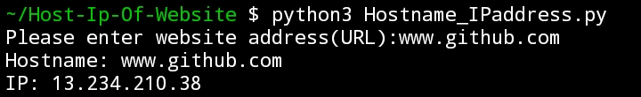

# Get Ip Address and Hostname of Website

Get the ip address and hostname of any website

### Prerequisites

None

### How to run the script

Execute `python3 Hostname_IPaddress.py`

### Screenshot/GIF showing the sample use of the script

## *Author Name*

[HackElite](https://github.com/hackelite01)

